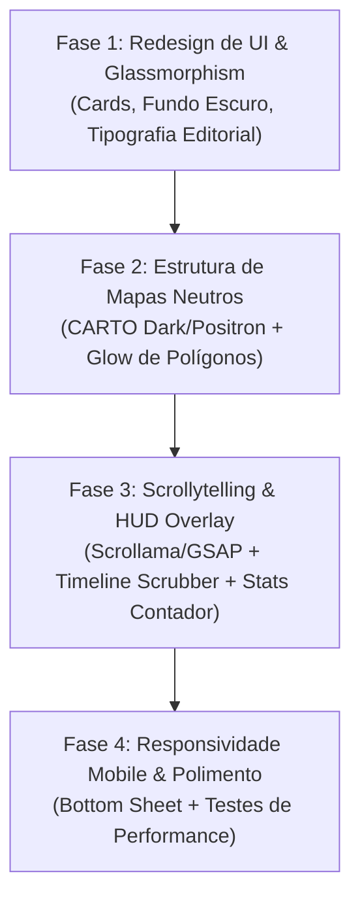

# Plano de Modernização UX/UI & Scrollytelling - Guia de Unidades de Conservação do Pará

> **Projeto:** Guia de Unidades de Conservação Estaduais do Pará (`guia-uc-para`)
> **Instituição:** Instituto de Desenvolvimento Florestal e da Biodiversidade do Estado do Pará (IDEFLOR-Bio)
> **Autor/Responsável:** Samuel C. Santos (`samuelsantosambiental@gmail.com`)
> **Repositório:** `guia-uc-para`
> **Data:** Outubro de 2026
> **Versão do Documento:** 1.0.0

---

## 1. Resumo Executivo e Conceito Visual ("Visual de Encher os Olhos")

O **Guia de Unidades de Conservação do Pará** é uma aplicação interativa baseada no paradigma de **Narrativa Geoespacial por Rolagem (*Scrollytelling*)**. Seu objetivo é conduzir o usuário por uma jornada cronológica e geográfica através das áreas protegidas criadas no Estado do Pará — desde a pioneira *APA do Marajó (1989)* até as recentes reservas florestais da Calha Norte e as Árvores Gigantes da Amazônia.

Este plano redefine a experiência do usuário para transformar o guia em uma **experiência editorial cinematográfica e imersiva**, combinando design ecológico de alto luxo, mapas base neutros sem custos de API, tipografia refinada, cartões com efeito *glassmorphism* e componentes de linha do tempo interativa.

---

## 2. Diagnóstico da Interface Atual vs. Visão de Modernização

| Aspeto da Aplicação | Estado Atual | Proposta de Modernização "Encher os Olhos" |
| :--- | :--- | :--- |
| **Estética dos Cartões** | Cartões brancos simples sobre fundo cinza neutro (`#f4f4f4`), sem hierarquia visual rica. | **Design Editorial Glassmorphism**: Cards translúcidos com efeito fosco (`backdrop-blur-md bg-emerald-950/40`), bordas brilhantes em degradê e tags coloridas. |
| **Mapa Base (Tile Layer)** | Uso de tiles padrão CARTO Positron com estilo plano e sem opções de comutação. | **Estratégia de Fundo Neutro & Satélite**: Suporte a *CARTO Positron* (fundo claro neutro), *CARTO Dark Matter* (modo noturno cinematográfico) e *Esri World Imagery* com máscara escura para máximo contraste de contornos. |
| **Conteúdo do Cartão** | Apenas Título, Data, ResumoBreve em texto corrido e Link simples. | **Cartão Enriquecido**: Badges de Categoria (*Proteção Integral* vs *Uso Sustentável*), Área em Hectares/km², Municípios abrangidos, tag da década e botão de ação ("Documento", "Estatísticas"). |
| **Linha do Tempo / Progresso** | Sem indicador visual do progresso de rolagem ou filtro por décadas. | **Timeline Scrubber Fixo + Filtro por Categoria**: Barra de progresso cronológica lateral com nós interativos por ano (1989 ➔ 2026) e botões de filtro rápido (APA, ESEC, FLOTA, REVIS). |
| **Painel de Mapa (HUD Overlay)** | O mapa é estático com sobreposição simples em verde. | **HUD de Estatísticas Dinâmicas**: Overlay flutuante no mapa exibindo em tempo real: *UC Ativa*, *Ano de Criação*, *Área da UC* e *Total Acumulado de Hectares Protegidos no Estado*. |
| **Experiência Mobile** | Divisão de coluna rígida `1.1fr 1fr` que espreme o mapa ou os cartões em dispositivos móveis. | **Layout Responsivo Adaptativo**: Em telas menores, os cartões deslizam como um *Bottom Sheet* com rolagem magnética (*Scroll Snap*) e mapa mantido em tela cheia. |

---

## 3. Design System & Identidade Visual (Tema Amazônia Cinematográfica)

### 3.1 Paleta de Cores (Dark Emerald & Light Organic)

#### Modo Noturno Cinematográfico (Padrão Recomendado para Scrollytelling Imersivo)
* **Fundo de Tela (Canvas):** `#060D0A` (Deep Rainforest Black)
* **Cartão Glassmorphism:** `rgba(15, 34, 25, 0.75)` com borda `rgba(16, 185, 129, 0.25)`
* **Verde Destaque / Glow de Polígono:** `#10B981` (Emerald Glow) / `#34D399`
* **Dourado Institucional (Proteção Integral / Conquistas):** `#F59E0B` (Amber Gold)
* **Azul Hidro (Recursos Hídricos / APA Marajó):** `#38BDF8` (Cyan Blue)
* **Texto Principal:** `#F1F5F9` (Slate White) | **Texto Secundário:** `#94A3B8`

#### Modo Claro Orgânico
* **Fundo de Tela (Canvas):** `#F8FAFC`
* **Cartões:** `#FFFFFF` com sombra natural `box-shadow: 0 20px 25px -5px rgba(0, 0, 0, 0.05)`
* **Borda Ativa:** `#059669` (Emerald 600)

### 3.2 Tipografia
* **Títulos & Cabeçalhos dos Cartões:** `Plus Jakarta Sans` ou `Outfit` (800 / Extrabold) — transmitindo elegância e peso editorial.
* **Corpo do Texto & Resumos:** `Inter` (400 / Regular, `line-height: 1.7`) para máxima legibilidade durante a leitura de resumos extensos.
* **Números e Datas:** `JetBrains Mono` ou `Space Grotesk` para a linha do tempo e indicadores numéricos de área.

---

## 4. Estratégia de Mapas Base Neutros (Sem Custos de API)

Conforme orientação técnica, descartamos serviços pagos ou com limites restritivos e adotamos provedores de tiles neutros de alta disponibilidade:

1. **CARTO Positron (`light_all`):**
 * *URL:* `https://{s}.basemaps.cartocdn.com/light_all/{z}/{x}/{y}{r}.png`
 * *Uso:* Perfeito para o modo claro. Fundo limpo, tons neutros cinza/branco, permitindo que os polígonos das UCs em verde/dourado se destaquem totalmente sem poluição visual.
2. **CARTO Dark Matter (`dark_all`):**
 * *URL:* `https://{s}.basemaps.cartocdn.com/dark_all/{z}/{x}/{y}{r}.png`
 * *Uso:* Padrão para o modo escuro imersivo. Fundo escuro sutil que destaca as bordas das UCs com efeito luminoso (*glow*).
3. **Esri World Imagery + Dark Overlay:**
 * *URL:* `https://server.arcgisonline.com/ArcGIS/rest/services/World_Imagery/MapServer/tile/{z}/{y}/{x}`
 * *Uso:* Para visualização de satélite real da cobertura vegetal da Amazônia durante a rolagem.

---

## 5. Arquitetura do Layout e Scrollytelling (Wireframe)

```
+---------------------------------------------------------------------------------------------------+
| IDEFLOR-Bio | GUIA DE UNIDADES DE CONSERVAÇÃO DO PARÁ             [Buscar] [Tema] [Som] |
+---------------------------------------------------+-----------------------------------------------+
| MAPA FIXO (STICKY CANVAS - 100VH)                 | PAINEL NARRATIVO DE ROLAGEM (SCROLL STEPS)    |
|                                                   |                                               |
|  [HUD OVERLAY TOP-LEFT]                           | ─── HERO INTRO SECTION ────────────────────── |
|  ┌──────────────────────────────────────────────┐ |  <h1>Uma Jornada pela Amazônia Protegida</h1> |
|  │ UC Ativa: ESEC Grão-Pará                     │ |  <p>Conheça as 26+ Unidades de Conservação  |
|  │ Categoria: Proteção Integral (ESEC)          │ |  do Estado do Pará criadas desde 1989.</p>  |
|  │ Área: 4.245.819 ha                           │ |                                               |
|  │ Acumulado no Estado: 21,5M ha                │ | ─── CARD CRONOLÓGICO #1 (1989) ───────────── |
|  └──────────────────────────────────────────────┘ |  ┌──────────────────────────────────────────┐ |
|                                                   |  │  USO SUSTENTÁVEL • APA                │ |
|        (Polígono da UC Ativa com Glow)            |  │ APA do Marajó                            │ |
|                                                   |  │  Criado em: 05/10/1989                │ |
|                                                   |  │  Área: 5.904.322 ha (59 mil km²)     │ |
|  [TIMELINE SCRUBBER LATERAL - 1989 ➔ 2026]        |  │  "É a maior UC na costa norte..."      │ |
|  ● 1989 ─── ● 1993 ─── ● 2006 ─── ● 2024          |  │ [ Ato de Criação]  [ Site IDEFLOR]  │ |
|                                                   |  └──────────────────────────────────────────┘ |
+---------------------------------------------------+-----------------------------------------------+
```

---

## 6. Funcionalidades Inovadoras de Interatividade & UX

### 6.1 Hero Intro com Contador de Impacto Ambiental
Ao abrir o site, uma tela inicial impactante apresenta o visualizador com estatísticas animadas (*CountUp.js*):
* **Total de UCs Estaduais Mapeadas** (ex: 26+ áreas)
* **Área Total Protegida em Hectares** (ex: +20 Milhões de ha)
* **Categorias:** Proteção Integral vs. Uso Sustentável

### 6.2 Cartões Narrativos Inteligentes (Rich Cards)
Cada cartão de UC conterá:
* **Badge de Categoria:**
 * *Proteção Integral* (ESEC, REBIO, PESAM, REVIS, PAGAM) — Destaque em Verde Esmeralda.
 * *Uso Sustentável* (APA, FLOTA, RDS) — Destaque em Âmbar/Dourado.
* **Métricas da UC:** Tag de área em hectares/km² e municípios abrangidos extraídos dinamicamente.
* **Leitura Estilo Editorial:** Formatação de citações (*blockquotes*), destaque para fauna/flora protegida (ex: Peixe-boi, Arara-Azul, Árvores Gigantes).
* **Ações Diretas:** Botão de navegação rápida "Ir para o Mapa", "Baixar GeoJSON da UC", "Abrir Decreto Oficial".

### 6.3 Linha do Tempo Scrubber (Timeline Navigation)
Uma barra lateral ou inferior fixa com os anos de criação das UCs. Conforme o usuário rola a página:
* O nó correspondente ao ano da UC ativa acende com efeito pulsante.
* O usuário pode clicar em qualquer ano (ex: *2006 — O boom de criação das Flotas da Calha Norte*) para saltar instantaneamente para aquela etapa.

### 6.4 Painel de Filtros e Busca Rápida
Menu gaveta retrátil atualizado para permitir:
* Busca textual inteligente por nome ou município.
* Filtros por **Década de Criação** (Anos 80, 90, 2000, 2010, 2020).
* Filtros por **Tipo de UC** (Apenas Parques, Apenas APAs, Apenas Florestas Estaduais).

### 6.5 Som Ambiente Opcional (Trilha Sonora de Natureza)
* Botão discreto no cabeçalho para ativar áudio ambiente suave de floresta amazônica/pássaros, enriquecendo a imersão sensorial.

---

## 7. Arquitetura Técnica & Performance

1. **Fusão Inteligente GeoJSON + CSV em Web Worker:**
 * Processar a união de atributos e ordenação cronológica via script dedicado para não causar micro-travamentos (*jank*) na rolagem da página.
2. **Biblioteca de Animação & Transição:**
 * Utilizar **GSAP (GreenSock)** ou **Scrollama.js** com `IntersectionObserver` para controle fino de animações de entrada dos cartões (*fade-in*, *slide-up*).
3. **Efeito Glow de Polígono no Leaflet:**
 * Estilização de polígonos dinâmicos com filtros SVG embutidos para contorno fluorescente da UC focalizada.
4. **Git Credentials & Padrão Local:**
 * Usuário local configurado: `samuel-c-santos` (`samuelsantosambiental@gmail.com`).

---

## 8. Roteiro de Implementação (Roadmap em Fases)



---

## 9. Conclusão

Com esta modernização, o **Guia de Unidades de Conservação do Pará** deixará de ser uma simples lista com mapa e se tornará um **portal institucional e educativo de nível internacional**, com narrativa visual cativante ("de encher os olhos"), perfeito para apresentações oficiais do IDEFLOR-Bio, eventos de meio ambiente (ex: COP30 em Belém) e consultas públicas.
